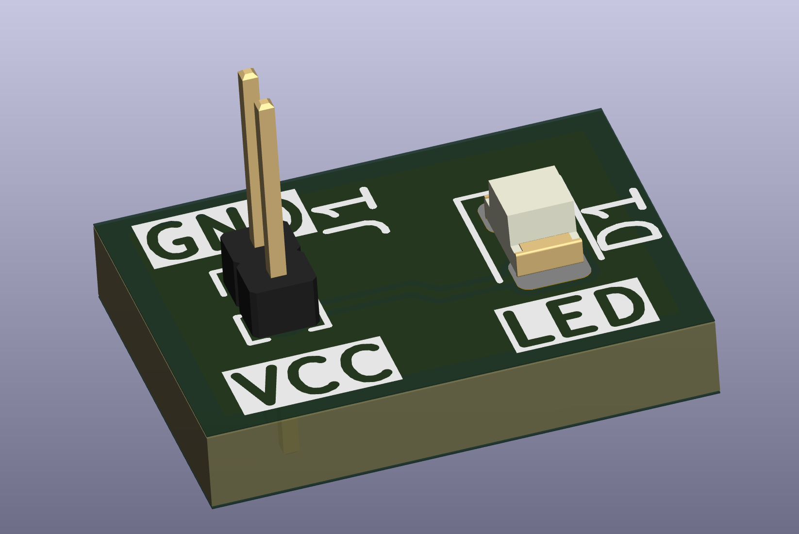
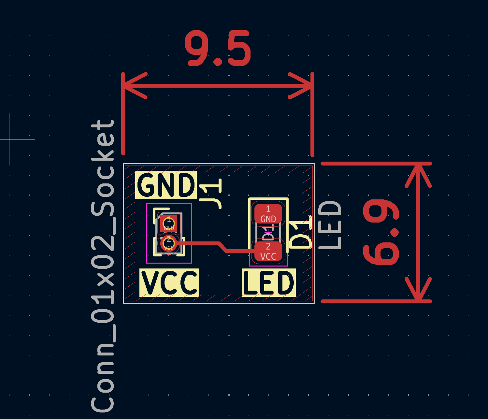

# Simple LED_circuit

Using KiCad a basic circuit of a led with pinout for connection with dupont connectors was created. 

This was a simple project just to test out the software and learn its niches. 

Creating the ground layer was especially challenging. This was mainly due to the small size of the circuit, due to clearance values the layer wasn't being applied properly. 

The final size of board is 9.1mm x 6.9mm 

references: